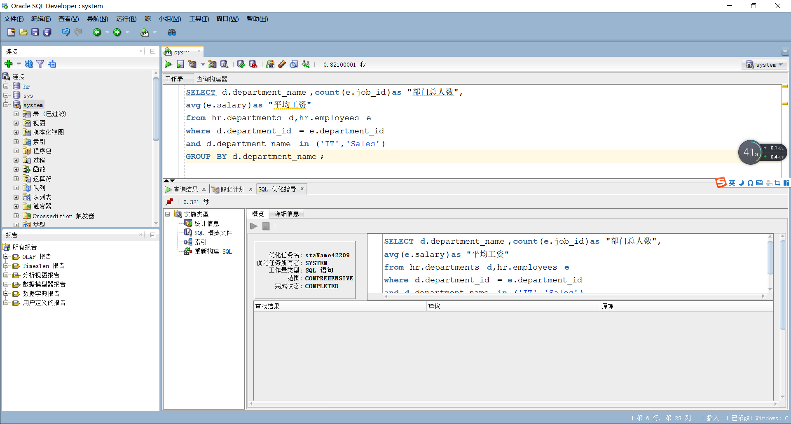
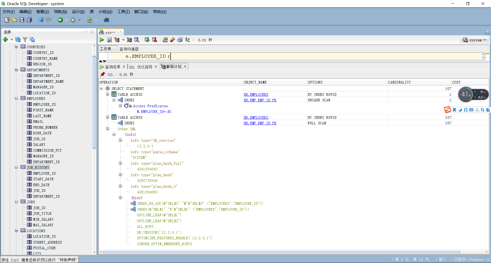

#### 姓名：陈耕

#### 学号：201810414107

#### 班级：18软工1班

# 实验1：SQL语句的执行计划分析与优化指导

## 实验目的

  分析SQL执行计划，执行SQL语句的优化指导。理解分析SQL语句的执行计划的重要作用。

## 实验内容

- 对Oracle12c中的HR人力资源管理系统中的表进行查询与分析。

- 首先运行和分析教材中的样例：本训练任务目的是查询两个部门('IT'和'Sales')的部门总人数和平均工资，以下两个查询的结果是一样的。但效率不相同。
- 设计自己的查询语句，并作相应的分析，查询语句不能太简单。

## 教材中的查询语句

查询1：

```SQL
set autotrace on

SELECT d.department_name,count(e.job_id)as "部门总人数",
avg(e.salary)as "平均工资"
from hr.departments d,hr.employees e
where d.department_id = e.department_id
and d.department_name in ('IT','Sales')
GROUP BY d.department_name;
```




- 查询2

```SQL
set autotrace on

SELECT d.department_name,count(e.job_id)as "部门总人数",
avg(e.salary)as "平均工资"
FROM hr.departments d,hr.employees e
WHERE d.department_id = e.department_id
GROUP BY d.department_name
HAVING d.department_name in ('IT','Sales');
```


执行上面两个比较复杂的返回相同查询结果数据集的SQL语句，通过分析SQL语句各自的执行计划，判断哪个SQL语句是最优的。最后将你认为最优的SQL语句通过sqldeveloper的优化指导工具进行优化指导，看看该工具有没有给出优化建议

**答**： 查询1的总代价2小于查询2的总代价5，查询1索引范围扫描10行，查询2全表扫描107行，综合来看查询1优于查询2。执行优化指导时，工具没有给出优化建议。

## 自己的查询语句

- 查询3
```SQL
SELECT
	e.EMPLOYEE_ID,
	e.FIRST_NAME,
	e.MANAGER_ID,
	( SELECT M.FIRST_NAME FROM HR.employees m WHERE m.EMPLOYEE_ID = e.MANAGER_ID ) AS MANAGER_NAME 
FROM
	HR.employees e 
ORDER BY
	e.EMPLOYEE_ID;
```





- 查询4
```SQL
SELECT
	e.EMPLOYEE_ID,
	e.FIRST_NAME,
	e.MANAGER_ID,
	m.FIRST_NAME AS MANAGER_NAME 
FROM
	HR.employees e,
	HR.employees m 
WHERE
	e.MANAGER_ID = m.EMPLOYEE_ID ( + ) 
ORDER BY
	e.EMPLOYEE_ID;
```


**答**：查询3代价21大于查询4代价6，查询3用了子查询语句作为一个字段属性，每输出employees的一行都要再次查询一次该表，查询4优于查询3

## 实验参考地址

- Oracle地址：202.115.82.8 用户名：system ， 密码123， 数据库名称：pdborcl，端口号：1521
- 用户hr默认没有统计权限，运行上述命令时要报错：

```text  
无法收集统计信息, 请确保用户具有正确的访问权限。
统计信息功能要求向用户授予 v_$sesstat, v_$statname 和 v_$session 的选择权限。
```

怎样解决？

**答**：普通用户不允许查询执行计划，必须有plustrace角色才可以。Oracle的插接式数据库本身并没有默认创建plustrace，所以需要首先    在pdborcl数据库中创建角色plustrace，方法是用sys登录到PDB数据库，然后运行$ORACLE_HOME/sqlplus/admin/plustrce.sql脚本文件，最后通过“GRANT plustrace to 用户名;”命令将plustrace赋予用户。

普通用户通常没有SQL优化的权限，需要添加SELECT_CATALOG_ROLE、SELECT ANY DICTIONARY、ADVISOR 以及 ADMINISTER SQL TUNING SET 权限才可以进行优化指导。
