#### 姓名：陈耕

#### 学号：201810414107

#### 班级：18软工1班

#### 用户名：system
# 实验6（期末考核） 基于Oracle的```购物系统```数据库设计


### 购物系统数据库表结构设计

#### USERS表（用户表）

|字段|类型|主键，外键|可以为空|默认值|约束|说明|
|:-------:|:-------------:|:------:|:----:|:---:|:----:|:----------|
|ID|NUMBER(10, 0)|主键|否| | | 用户ID|
|USERNAME|VARCHAR2(50 BYTE)| |否| | | 用户名 |
|PASSWORD|VARCHAR2(50 BYTE)| |否|| | 密码 |
|ADDRESS|VARCHAR2(50 BYTE)| |否|| | 收货地址 |
|TEL|VARCHAR2(20 BYTE)| |否|| | 收货人电话 |
|CREATE_TIME|DATE| |否| | |用户注册时间|

#### GOODS表（商品表）

|    字段     |        类型        | 主键，外键 | 可以为空 | 默认值 | 约束 | 说明     |
| :---------: | :----------------: | :--------: | :------: | :----: | :--: | :------- |
|     ID      |   NUMBER(10, 0)    |    主键    |    否    |        |      | 商品ID   |
|    NAME     | VARCHAR2(50 BYTE)  |            |    否    |        |      | 商品名称 |
|    PRICE    |    NUMBER(8, 2)    |            |    否    |        |      | 商品单价 |
|   PROFILE   | VARCHAR2(100 BYTE) |            |    否    |        |      | 商品简介 |
|    STOCK    |   NUMBER(10, 0)    |            |    否    |        |      | 商品库存 |
| CATEGORY_ID |   NUMBER(10, 0)    |    外键    |    否    |        |      | 类别ID   |

#### CATEGORY表（商品类别表）

| 字段 |       类型        | 主键，外键 | 可以为空 | 默认值 | 约束 | 说明     |
| :--: | :---------------: | :--------: | :------: | :----: | :--: | :------- |
|  ID  |   NUMBER(10, 0)   |    主键    |    否    |        |      | 类别ID   |
| NAME | VARCHAR2(20 BYTE) |            |    否    |        |      | 类别名称 |

#### ORDERS表（订单表）

|    字段     |       类型        | 主键，外键 | 可以为空 | 默认值 | 约束 | 说明         |
| :---------: | :---------------: | :--------: | :------: | :----: | :--: | :----------- |
|     ID      |   NUMBER(10, 0)   |    主键    |    否    |        |      | 订单ID       |
|   USER_ID   |   NUMBER(10, 0)   |    外键    |    否    |        |      | 用户ID       |
| TOTAL_PRICE |   NUMBER(8, 2)    |            |    否    |        |      | 订单总金额   |
| CREATE_TIME |       DATE        |            |    否    |        |      | 订单创建时间 |
|   STATUS    | VARCHAR2(20 BYTE) |            |    否    | 未支付 |      | 订单状态     |

#### ORDER_GOODS表（订单商品关系表）

|   字段    |     类型      | 主键，外键 | 可以为空 | 默认值 | 约束 | 说明     |
| :-------: | :-----------: | :--------: | :------: | :----: | :--: | :------- |
|    ID     | NUMBER(10, 0) |    主键    |    否    |        |      | 唯一标识 |
| ORDER_ID  | NUMBER(10, 0) |    外键    |    否    |        |      | 订单ID   |
| GOODS_ID  | NUMBER(10, 0) |    外键    |    否    |        |      | 商品ID   |
| GOODS_NUM | NUMBER(10, 0) |            |    否    |        |      | 商品数量 |


### 设计项目涉及的表及表空间使用方案。至少5张表和5万条数据，两个表空间

  #### 创建表空间`users02`
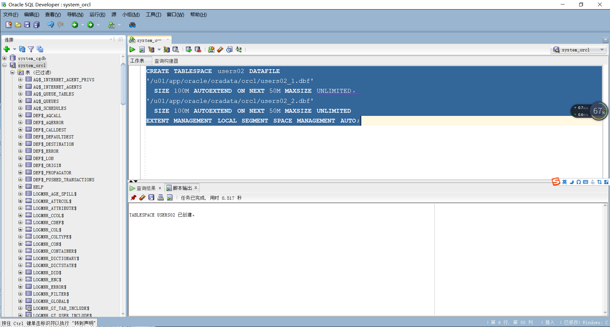

  #### 创建表空间```users03```
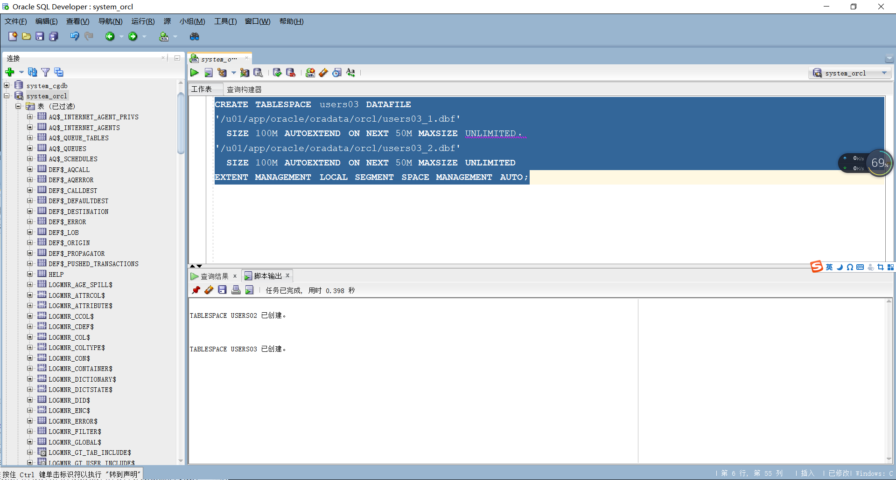

  #### 查看表空间的数据库文件，以及每个文件的磁盘占用情况
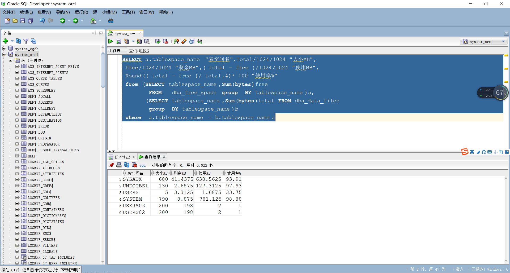

#### 设计权限及用户分配方案。至少两类角色，两个用户
以system用户登录到orcl，创建角色role1和用户user1，并授权和分配表空间
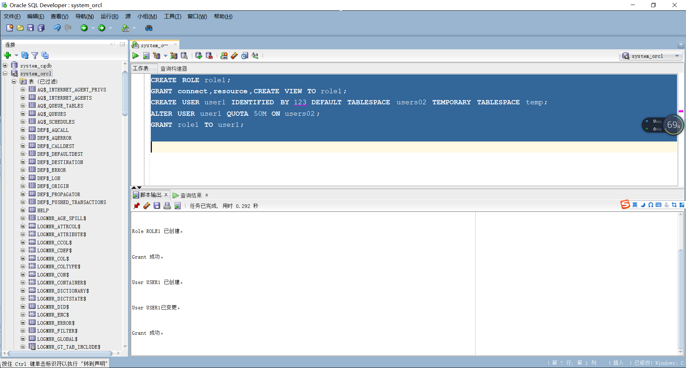

以system用户登录到orcl，创建角色role2和用户user2，并授权和分配表空间


#### 创建表  

创建USERS表

  `CREATE TABLE USERS
  (
    ID NUMBER(10, 0) NOT NULL
  , USERNAME VARCHAR2(50 BYTE) NOT NULL
  , PASSWORD VARCHAR2(50 BYTE) NOT NULL
  , ADDRESS VARCHAR2(50 BYTE) NOT NULL
  , TEL VARCHAR2(20 BYTE) NOT NULL
  , CREATE_TIME DATE NOT NULL
  , CONSTRAINT USER_PK PRIMARY KEY
    (
      ID
    )
    USING INDEX
    (
        CREATE UNIQUE INDEX USER_PK ON USERS (ID ASC)
        LOGGING
        TABLESPACE USERS02
        PCTFREE 10
        INITRANS 2
        STORAGE
        (
          BUFFER_POOL DEFAULT
        )
        NOPARALLEL
    )
    ENABLE
  )
  TABLESPACE USERS02
  PCTFREE 10
  INITRANS 1
  STORAGE
  (
    BUFFER_POOL DEFAULT
  )
  NOCOMPRESS
  NOPARALLEL`
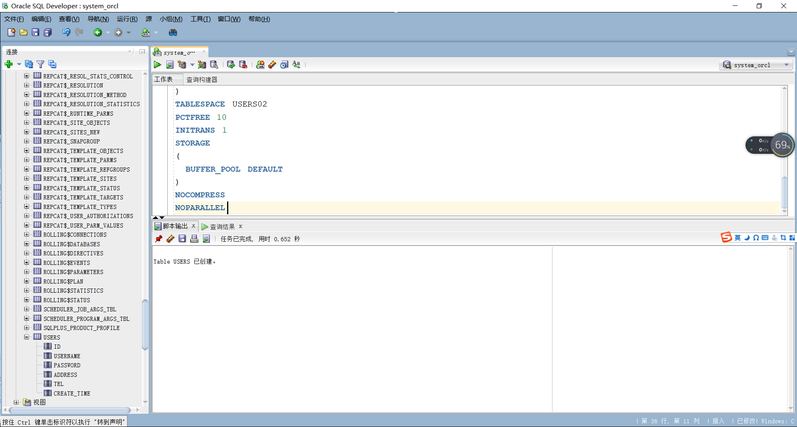


创建GOODS表
`CREATE TABLE GOODS
(
  ID NUMBER(10, 0) NOT NULL
, NAME VARCHAR2(50 BYTE) NOT NULL
, PRICE NUMBER(8, 2) NOT NULL
, PROFILE VARCHAR2(100 BYTE) NOT NULL
, STOCK NUMBER(10, 0) NOT NULL
, CATEGORY_ID NUMBER(10, 0) NOT NULL
, CONSTRAINT GOODS_PK PRIMARY KEY
  (
    ID
  )
  USING INDEX
  (
      CREATE UNIQUE INDEX GOODS_PK ON GOODS (ID ASC)
      LOGGING
      TABLESPACE USERS02
      PCTFREE 10
      INITRANS 2
      STORAGE
      (
        BUFFER_POOL DEFAULT
      )
      NOPARALLEL
  )
  ENABLE
)
TABLESPACE USERS02
PCTFREE 10
INITRANS 1
STORAGE
(
  BUFFER_POOL DEFAULT
)
NOCOMPRESS
NOPARALLEL`
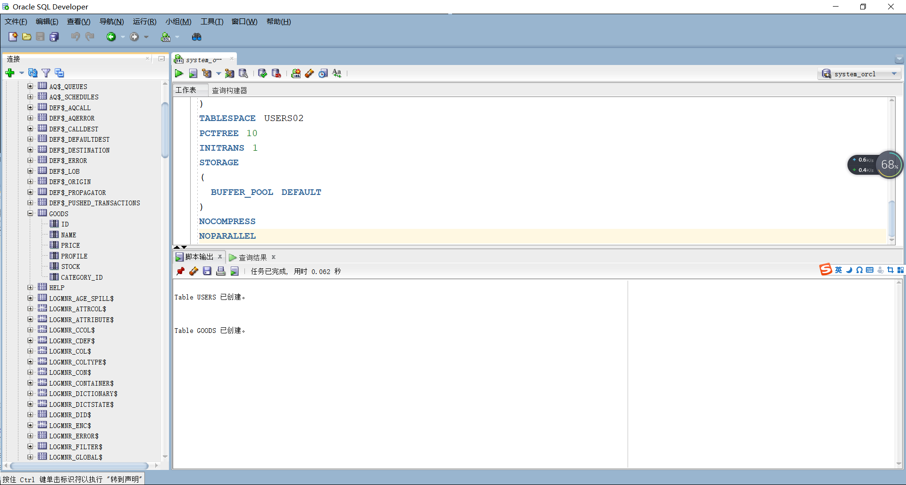


创建CATEGORY表

`CREATE TABLE CATEGORY
(
  ID NUMBER(10, 0) NOT NULL
, NAME VARCHAR2(20 BYTE) NOT NULL
, CONSTRAINT CATEGORY_PK PRIMARY KEY
  (
    ID
  )
  USING INDEX
  (
      CREATE UNIQUE INDEX CATEGORY_PK ON CATEGORY (ID ASC)
      LOGGING
      TABLESPACE USERS02
      PCTFREE 10
      INITRANS 2
      STORAGE
      (
        BUFFER_POOL DEFAULT
      )
      NOPARALLEL
  )
  ENABLE
)
TABLESPACE USERS02
PCTFREE 10
INITRANS 1
STORAGE
(
  BUFFER_POOL DEFAULT
)
NOCOMPRESS
NOPARALLEL`
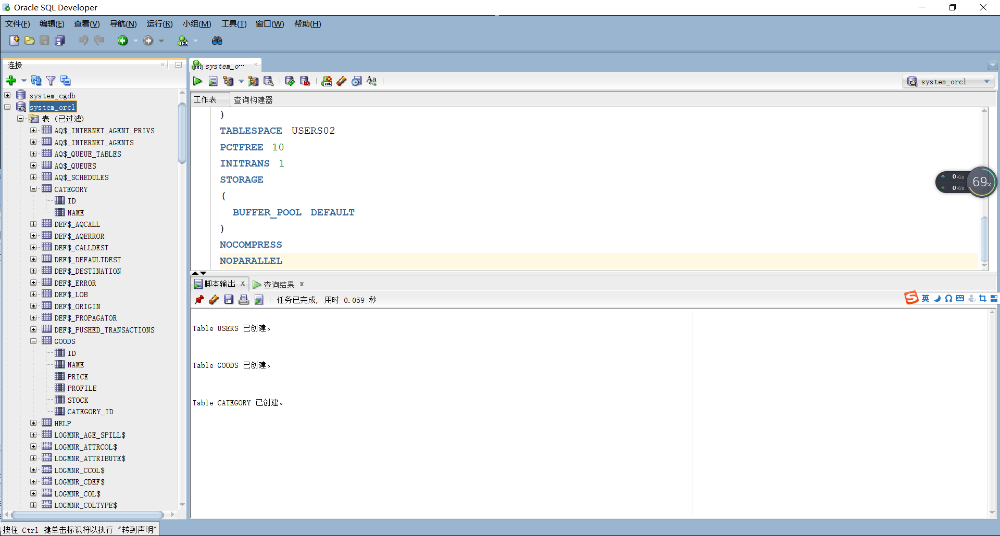


创建ORDER_GOODS表

`CREATE TABLE ORDER_GOODS
(
  ID NUMBER(10, 0) NOT NULL
, ORDER_ID NUMBER(10, 0) NOT NULL
, GOODS_ID NUMBER(10, 0) NOT NULL
, GOODS_NUM NUMBER(10, 0) NOT NULL
, CONSTRAINT ORDER_GOODS_PK PRIMARY KEY
  (
    ID
  )
  USING INDEX
  (
      CREATE UNIQUE INDEX ORDER_GOODS_PK ON ORDER_GOODS (ID ASC)
      LOGGING
      TABLESPACE USERS02
      PCTFREE 10
      INITRANS 2
      STORAGE
      (
        BUFFER_POOL DEFAULT
      )
      NOPARALLEL
  )
  ENABLE
)
TABLESPACE USERS02
PCTFREE 10
INITRANS 1
STORAGE
(
  BUFFER_POOL DEFAULT
)
NOCOMPRESS
NOPARALLEL`


创建ORDERS表

`CREATE TABLE ORDERS
(
  ID NUMBER(10, 0) NOT NULL
, USER_ID NUMBER(10, 0) NOT NULL
, TOTAL_PRICE NUMBER(8, 2) NOT NULL
, CREATE_TIME DATE NOT NULL
, STATUS VARCHAR2(20 BYTE) NOT NULL
, CONSTRAINT ORDERS_PK PRIMARY KEY
  (
    ID
  )
  USING INDEX
  (
      CREATE UNIQUE INDEX ORDERS_PK ON ORDERS (ID ASC)
      LOGGING
      TABLESPACE USERS02
      PCTFREE 10
      INITRANS 2
      STORAGE
      (
        BUFFER_POOL DEFAULT
      )
      NOPARALLEL
  )
  ENABLE
)
TABLESPACE USERS02
PCTFREE 10
INITRANS 1
STORAGE
(
  BUFFER_POOL DEFAULT
)
NOCOMPRESS
NOPARALLEL
PARTITION BY RANGE (CREATE_TIME)
(
  PARTITION PARTITION_BEFORE_2018 VALUES LESS THAN (TO_DATE(' 2018-01-01 00:00:00', 'SYYYY-MM-DD HH24:MI:SS', 'NLS_CALENDAR=GREGORIAN'))
  NOLOGGING
  TABLESPACE USERS02
  PCTFREE 10
  INITRANS 1
  STORAGE
  (
    INITIAL 8388608
    NEXT 1048576
    MINEXTENTS 1
    MAXEXTENTS UNLIMITED
    BUFFER_POOL DEFAULT
  )
  NOCOMPRESS NO INMEMORY
, PARTITION PARTITION_BEFORE_2022 VALUES LESS THAN (TO_DATE(' 2022-01-01 00:00:00', 'SYYYY-MM-DD HH24:MI:SS', 'NLS_CALENDAR=GREGORIAN'))
  NOLOGGING
  TABLESPACE USERS03
  PCTFREE 10
  INITRANS 1
  STORAGE
  (
    BUFFER_POOL DEFAULT
  )
  NOCOMPRESS NO INMEMORY
);`
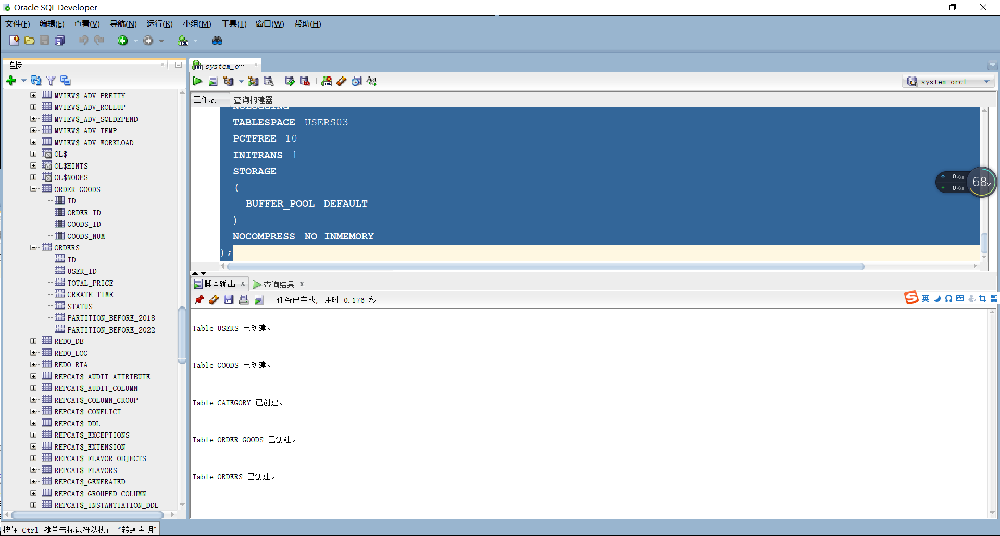


#### 添加模拟数据

添加商品模拟数据 

`declare
    v_id NUMBER(10,0);
    v_name VARCHAR2(50);
    v_price NUMBER(8,2);
    v_profile VARCHAR2(100);
    v_stock NUMBER(10,0);
    v_cate_id NUMBER(10,0);
begin
    for i in 1..1000
    loop
        v_id:=i;
        v_name:='商品'||i;
        v_price:=i mod 500 + 1;
        v_profile:='这是商品'||i||'的简介';
        v_stock:=i mod 200 + 100;
        v_cate_id:=i mod 10 + 1;
        insert into GOODS(ID,NAME,PRICE,PROFILE,STOCK,CATEGORY_ID)
            values(v_id,v_name,v_price,v_profile,v_stock,v_cate_id);
    end loop;
end;`

添加商品类别模拟数据

`declare
    v_id NUMBER(10,0);
    v_name VARCHAR2(20);
begin
    for i in 1..10
    loop
        v_id:=i;
        v_name:='类别'||i;
        insert into CATEGORY(ID,NAME)
            values(v_id,v_name);
    end loop;
end;`

添加用户模拟数据

`declare
    v_id NUMBER(10,0);
    v_uname VARCHAR2(50);
    v_pwd VARCHAR2(50);
    v_addr VARCHAR2(50);
    v_tel VARCHAR2(20);
    v_ct DATE;
begin
    for i in 1..10000
    loop
        v_id:=i;
        v_uname:='用户'||i;
        v_pwd:='123';
        v_addr:='这是用户'||i||'的收货地址';
        v_tel:=concat('1875684',((i mod 9000)+1000));
        v_ct:=to_date('2015-1-5','yyyy-mm-dd')+(i mod 60);
        insert into USERS(ID,USERNAME,PASSWORD,ADDRESS,TEL,CREATE_TIME)
            values(v_id,v_uname,v_pwd,v_addr,v_tel,v_ct);
    end loop;
end;`

添加订单商品关系模拟数据

`declare
    v_id NUMBER(10,0);
    v_oid NUMBER(10,0);
    v_gid NUMBER(10,0);
    v_gnum NUMBER(10,0);
begin
    for i in 1..50000
    loop
        v_id:=i;
        v_oid:=i;
        v_gid:=(i mod 1000)+1;
        select round(dbms_random.value(1,5)) into v_gnum from dual;
        insert into ORDER_GOODS(ID,ORDER_ID,GOODS_ID,GOODS_NUM)
            values(v_id,v_oid,v_gid,v_gnum);
    end loop;
end;`

添加订单模拟数据

`declare
    v_id NUMBER(10,0);
    v_uid NUMBER(10,0);
    v_tp NUMBER(8,2);
    v_ct DATE;
    v_status VARCHAR2(20);
begin
    for i in 1..50000
    loop
        v_id:=i;
        v_uid:=(i mod 10000);
        if (i mod 2)=0 then
            v_status:='已支付';
            v_ct:=to_date('2017-5-8','yyyy-mm-dd') +  (i mod 60);
        else
            v_status:='未支付';
            v_ct:=to_date('2021-5-8','yyyy-mm-dd') + (i mod 60);
        end if;
        select DISTINCT g.price*og.goods_num into v_tp
            from order_goods og, goods g
            where og.goods_id=g.id and og.order_id=i;
        insert into ORDERS(ID,USER_ID,TOTAL_PRICE,CREATE_TIME,STATUS)
            values(v_id,v_uid,v_tp,v_ct,v_status);
    end loop;
end;`

#### 再次查看表空间使用情况
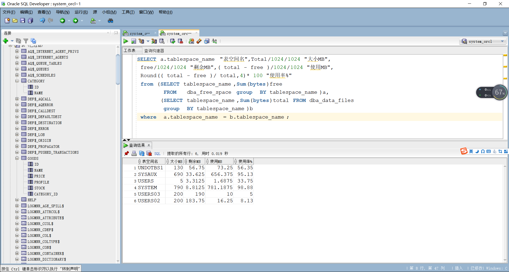


### 在数据库中建立一个程序包，在包中用PL/SQL语言设计一些存储过程和函数，实现比较复杂的业务逻辑，用模拟数据进行执行计划分析

#### 创建程序包

create or replace PACKAGE MyPack Is
	function getOrderTotalPrice(order_id number) return number;
	procedure addUser(id NUMBER,uname VARCHAR2,pwd VARCHAR2,addr VARCHAR2,tel VARCHAR2,ct DATE);
end MyPack;
/

create or replace PACKAGE body MyPack Is
	function getOrderTotalPrice(order_id number) return number as
		begin
			declare v_tp number;
			query_sql varchar2(200);
            begin
				query_sql:='select DISTINCT g.price*og.goods_num
								from order_goods og, goods g
								where og.goods_id=g.id and og.order_id='||order_id;
				execute immediate query_sql into v_tp;
				return v_tp;
            end;
       end getOrderTotalPrice;

	procedure addUser(id NUMBER,uname VARCHAR2,pwd VARCHAR2,addr VARCHAR2,tel VARCHAR2,ct DATE) as
		begin
			begin
				insert into USERS(ID,USERNAME,PASSWORD,ADDRESS,TEL,CREATE_TIME)
					values(id,uname,pwd,addr,tel,ct);
				commit;
			end;
		end addUser;
end MyPack;
/

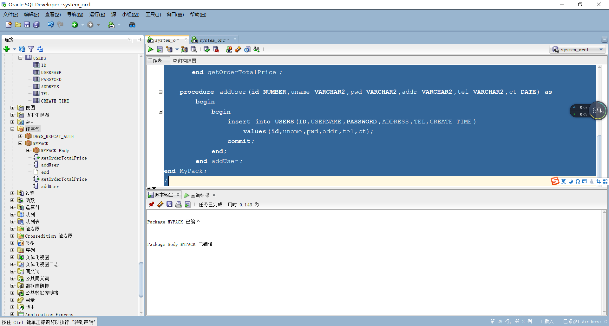


#### 执行计划分析

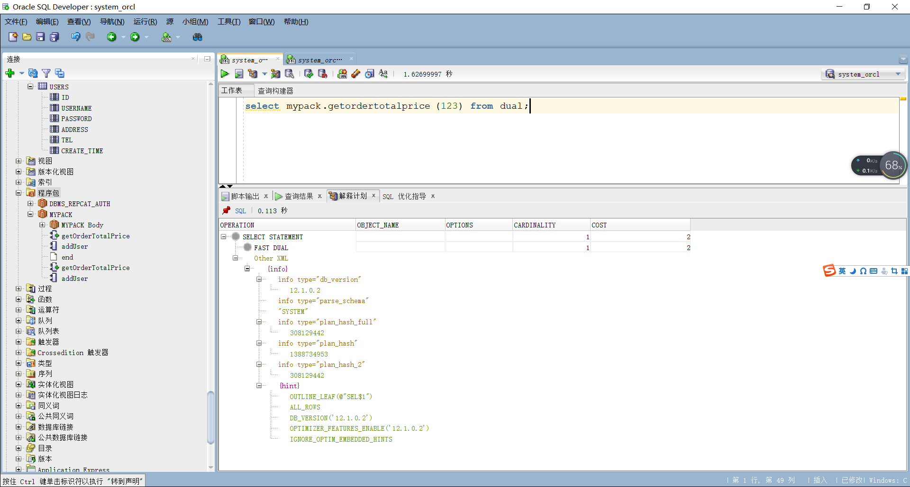

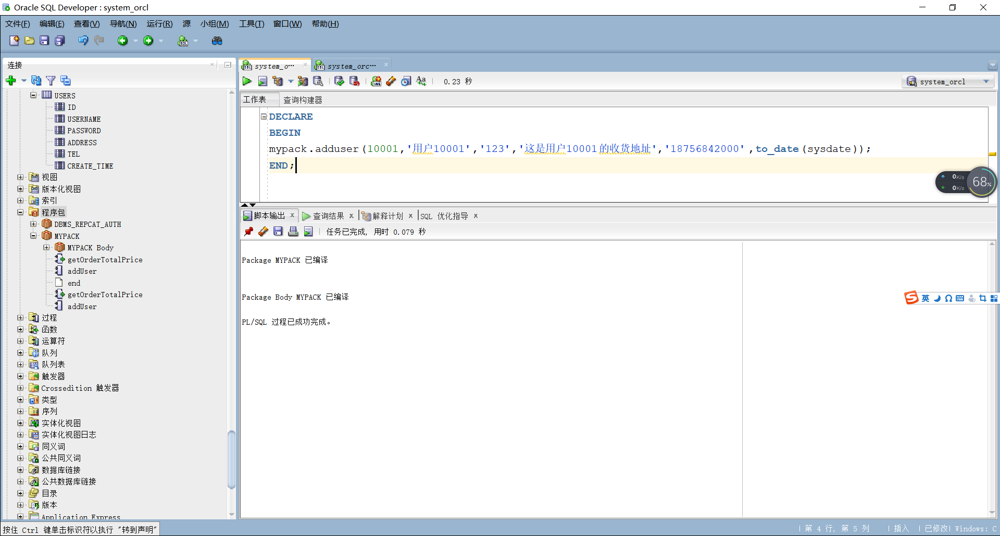

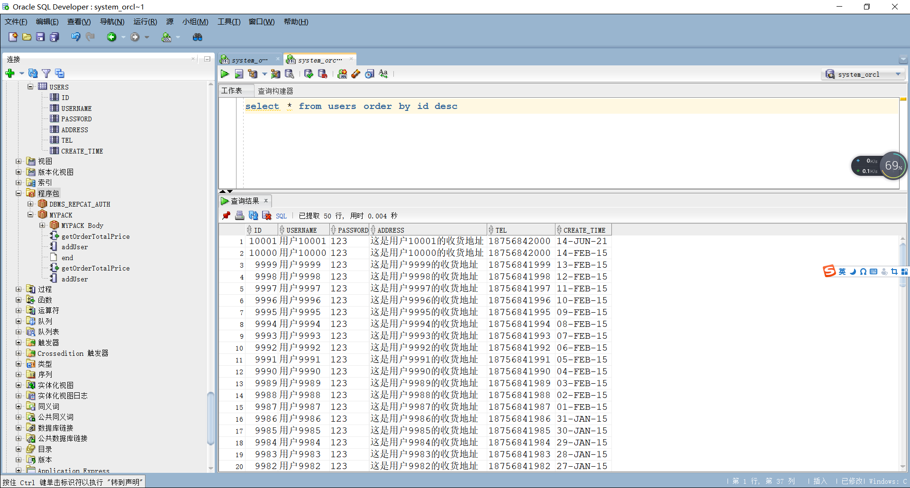


### 设计自动备份方案或则手工备份方案

#### Oracle切换到归档模式

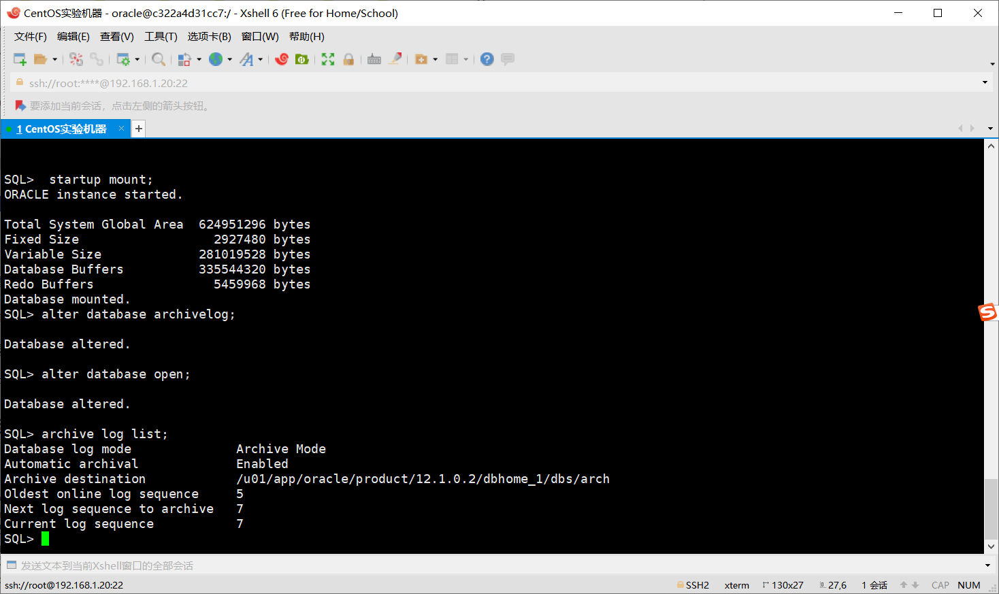


#### 全库0级备份(只作一次)

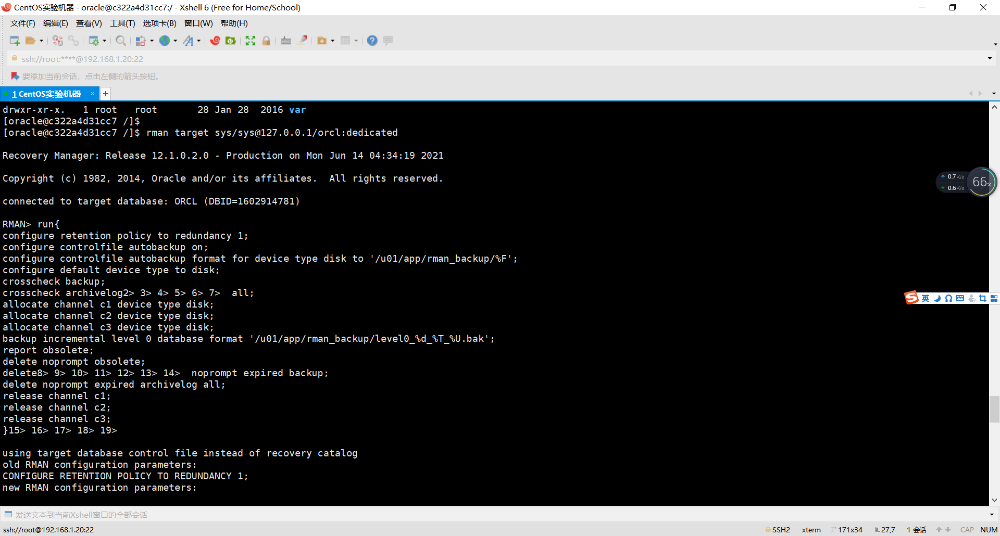


#### 全库1级增量备份

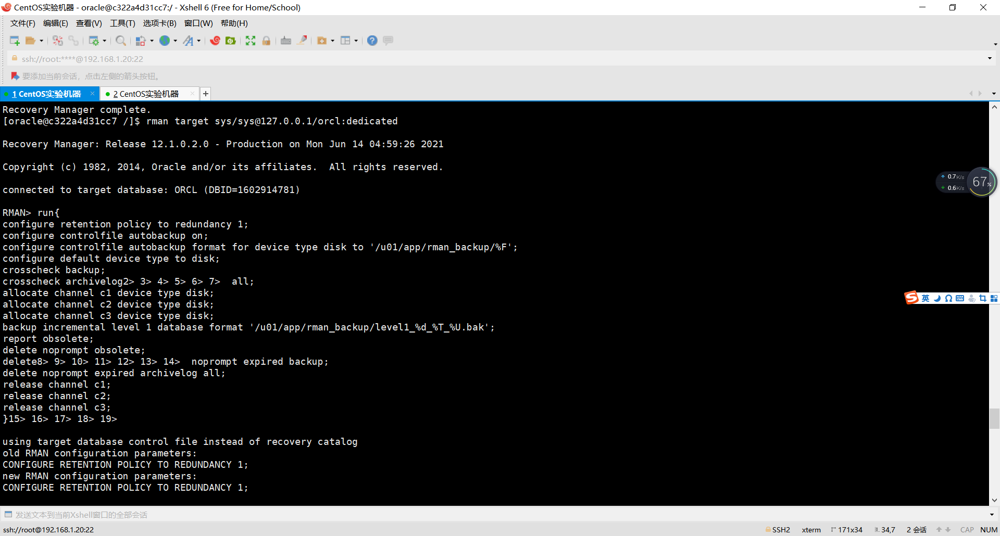


#### 查看备份文件

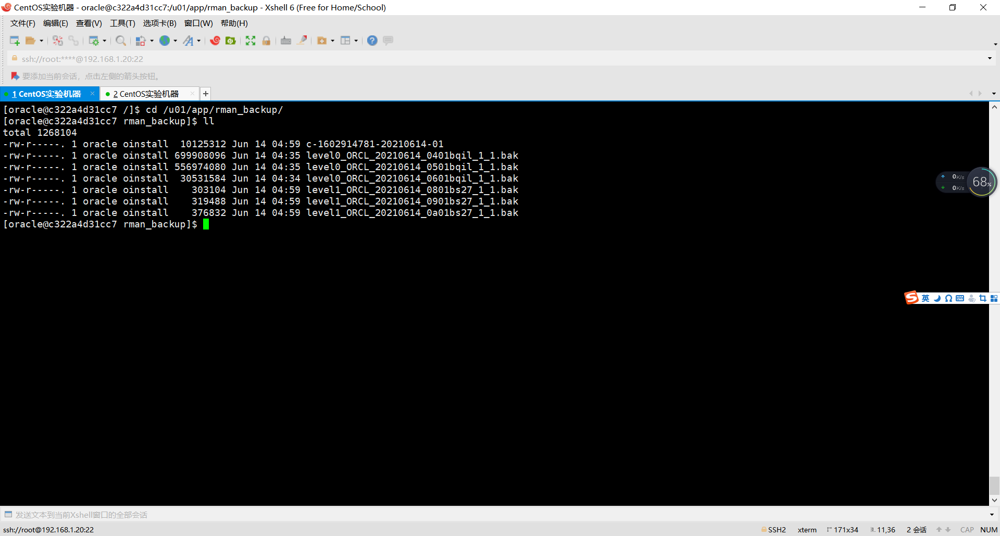


#### 全库完全恢复

全库停机
rman target /
RMAN> shutdown immediate;
RMAN> exit

文件改名，模拟文件损失

mv /u01/app/oracle/oradata/orcl/users02_1.dbf  /u01/app/oracle/oradata/orcl/users02_1.dbf2

全库恢复
rman target /
RMAN> startup mount;
RMAN> restore database;
RMAN> recover database;
RMAN> alter database open;

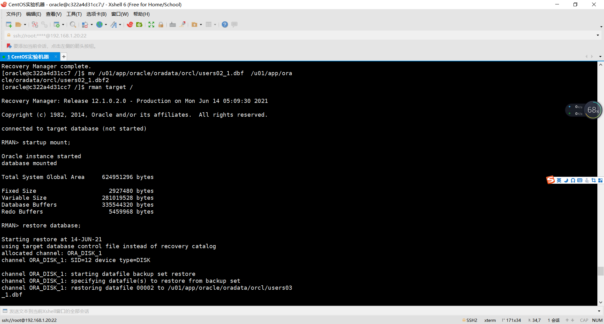

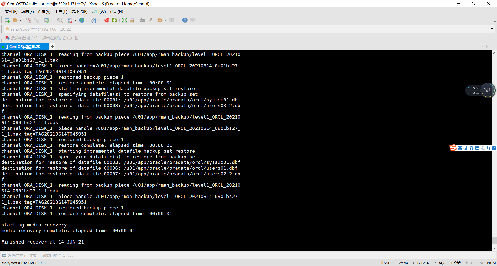


  - 设计容灾方案。使用两台主机，通过DataGuard实现数据库整体的异地备份(可选)。

## 实验注意事项，完成时间： 2021-6-15日前上交

- 实验在自己的计算机上完成。
- 文档`必须提交`到你的Oracle项目中的test6目录中。文档必须上传两套，因此你的test6目录中必须至少有两个文件：
  - 一个是Markdown格式的，文件名称是test6.md。
  - 另一个是Word格式的，文件名称是test6_design.docx。参见[test6_design.docx](./test6_design.docx)，文件不用打印。
- 上交后，通过这个地址应该可以打开你的源码：https://github.com/你的用户名/oracle/tree/master/test6
- 文档中所有设计和数据都必须是你自己独立完成的真实实验结果。不得抄袭，杜撰。

## 评分标准

| 评分项|评分标准|满分|
|:-----|:-----|:-----|
|文档整体|文档内容详实、规范，美观大方|10|
|表设计|表，表空间设计合理，数据合理|20|
|用户管理|权限及用户分配方案设计正确|20|
|PL/SQL设计|存储过程和函数设计正确|30|
|备份方案|备份方案设计正确|20|